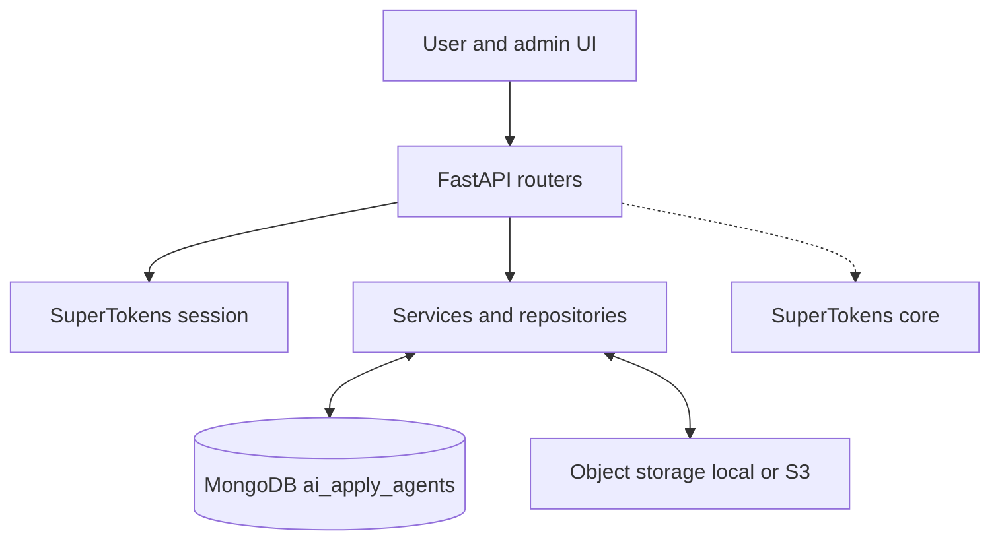
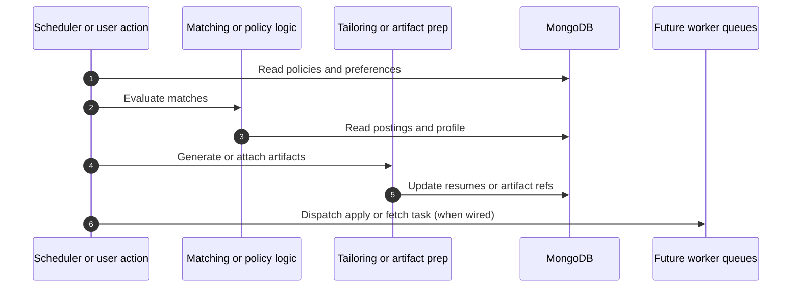

# Control Service architecture

**Code:** `apps/server` — FastAPI **Control Service** (default port **8000**).

**Frontend:** `apps/client` (Vite, port **5173**).

**Persistence:** **MongoDB** database (default name `ai_apply_agents`) via **Motor**; Pydantic v2 models. **SuperTokens** handles auth/session (core on PostgreSQL in Docker — separate from domain data).

---

## Purpose

Orchestration, user/tenant admin, profiles, resumes, master profile, preferences, policies, workflows, uploads, monitoring views, and audit/notifications. It does **not** scrape job boards or run browser apply flows (those belong to other packages).

---

## HTTP surface (routers)

Registered in `apps/server/src/main.py`:

| Prefix / area | Module | Role |
|---------------|--------|------|
| Tenants | `routers/tenants.py` | Tenant CRUD (admin) |
| Users | `routers/users.py` | User listing, role updates |
| Profiles | `routers/profiles.py` | `UserProfile`, `UserDocument` |
| Preferences | `routers/preferences.py` | `JobPreference` |
| Policies | `routers/policies.py` | `AutomationPolicy` |
| Workflows | `routers/workflows.py` | `WorkflowRun`, `TaskRun` |
| Resumes | `routers/resumes.py` | `Resume` CRUD, markdown import |
| Master sections | `routers/master_sections.py` | Master profile + AI tailor |
| Uploads | `routers/uploads.py` | Images/PDF/DOCX → storage backend |
| Monitoring | `routers/monitoring.py` | Application runs, attempts, fetch runs, postings, matches (manager+) |
| Admin | `routers/admin.py` | Dashboard stats, notifications |

**Global routes:** `GET /health`, `GET /me` (session user summary).

**CORS:** Local Vite origins; SuperTokens middleware applied before CORS.

---

## Auth and tenancy

- **SuperTokens** session verification on protected routes (`dependencies.py`).
- Bootstrap: default tenant `slug=default` created if missing; `ADMIN_EMAIL` can promote a user to `admin` on startup.
- **Roles:** `admin`, `manager`, `member` (`models/users.py`).
- Requests resolve **`tenant_id`** for tenant-scoped data; repositories consistently filter by `tenant_id`.

---

## Storage

`config.py`: `storage_backend` (`local` \| `s3`), `upload_dir`, optional S3 settings. Factory: `services/storage/`. Upload API returns `key`, `url`, `content_type` for use in profiles and documents.

---

## Domain services (examples)

- **`services/master_sections.py`** — Master profile sections; AI tailoring (Anthropic when `ANTHROPIC_API_KEY` set).
- **`services/resume/service.py`** — Resume analysis/build helpers using profile/master data.
- **`services/monitoring.py`** — Read-only aggregation for execution collections.
- **`services/admin.py`** — Admin dashboard counts and notifications listing.

---

## Data ownership

Owns all MongoDB collections listed in [data-model-mongodb.md](./data-model-mongodb.md): users, profiles, documents, resumes, master_sections, preferences, policies, job_* , runs, artifacts, audit, notifications.

---

## High-level diagram (logical)



---

## Auto-apply policy flow (conceptual)

The repository includes workflow and task models for orchestration. **Resume tailoring** and **matching** are implemented in the control layer; **full end-to-end queue dispatch** to the fetcher/applier may evolve with integrations. See workflow endpoints under `/workflows` and monitoring under `/monitoring`.



---

## Package layout (actual)

Illustrative mapping under `apps/server/src/`:

```
routers/       # FastAPI route modules
models/        # Pydantic domain documents
repositories/  # Motor CRUD
services/      # Business logic, AI, admin, storage
dependencies.py
db.py          # Mongo client and indexes
supertokens_config.py
```

---

## Related docs

- [MongoDB data model](./data-model-mongodb.md) (authoritative schema)
- [System architecture](./architecture.md)
- [Job Fetcher](./architecture-job-fetcher.md) / [Job Applier](./architecture-job-applier.md)
