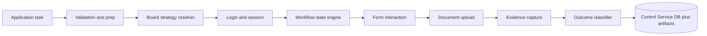
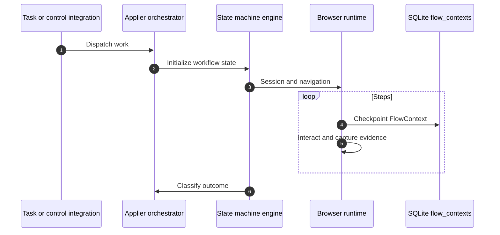

# Job Applier architecture

**Package:** `packages/jobs_applier` — browser automation and apply execution (dev port **8002**).

**Entry:** `packages/jobs_applier/src/main.py` / `main.py` runs **uvicorn** on the FastAPI app from `api/app.py` (`create_app()`).

---

## Current implementation

- **FastAPI “Bot API”** with routers for **control**, **status**, **config** (`api/routers/`).
- **Camoufox-based flows** under `bot/flows/` (e.g. login, signup redirect, `job_apply`).
- **Flow orchestration** via `bot/control/` (manager, checkpoints, composite flows).
- **Resumable state:** **`FlowContext`** snapshots are persisted to **SQLite** (`packages/jobs_applier` working directory), table `flow_contexts` — see `bot/persistence.py` (**not** MongoDB).

**Link to Control Service data:** `ApplicationAttempt` in `apps/server/src/models/runs.py` includes **`flow_id`**, intended to align with the applier’s `FlowContext.flow_id` for correlation when end-to-end wiring is complete.

---

## MongoDB vs SQLite in this repo

| Concern | Store |
|---------|--------|
| User, job match, application run metadata | **MongoDB** (`application_runs`, `application_attempts`, …) via Control Service |
| In-flight bot flow snapshot | **SQLite** `bot_state.db` |

---

## High-level execution path

---

## Ownership rules

- **Owns:** apply strategies, browser primitives, step traces, screenshot/log artifacts (as integrated), SQLite checkpoints.
- **Does not own:** user CRUD, job fetching/normalization, matching scores (Control Service).

---

## Related docs

- [`application_runs` / `application_attempts`](./data-model-mongodb.md)
- [System architecture](./architecture.md)
