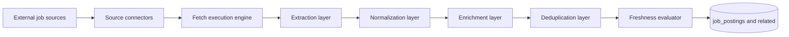

# Job Fetcher architecture

**Package:** `packages/jobs_scraper` — intended **Job Fetcher** service (dev port **8001** in monorepo scripts).

---

## Current implementation status

The service entrypoint (`packages/jobs_scraper/src/main.py`) is a **minimal FastAPI app**:

- `GET /health` — liveness
- `GET /scrape` — placeholder response

There is **no** separate MongoDB connection in this package yet. **Job ingestion domain models** (`JobSource`, `JobPosting`, `FetchRun`, etc.) live in the **Control Service** (`apps/server/src/models/jobs.py`, `models/runs.py`) and are stored in the shared **`ai_apply_agents`** database. Indexes for `job_sources`, `job_postings`, and `fetch_runs` are created in `apps/server/src/db.py`.

**Implication:** Fetcher logic should **normalize into those collections** (or emit events to the control plane) when implemented — see [data-model-mongodb.md](./data-model-mongodb.md).

---

## Target architecture (unchanged intent)

The conceptual pipeline remains: **external sources → connectors → execution → extraction → normalization → dedupe → freshness → persistence**.

---

## Ownership rules

- **Owns:** board adapters, fetch execution, normalization to the shared posting shape, dedupe signals, fetch run telemetry.
- **Does not own:** user CRUD, application submission, ranking UI logic (Control Service).

---

## Related docs

- [MongoDB `job_*` and `fetch_runs` shapes](./data-model-mongodb.md)
- [System architecture](./architecture.md)
