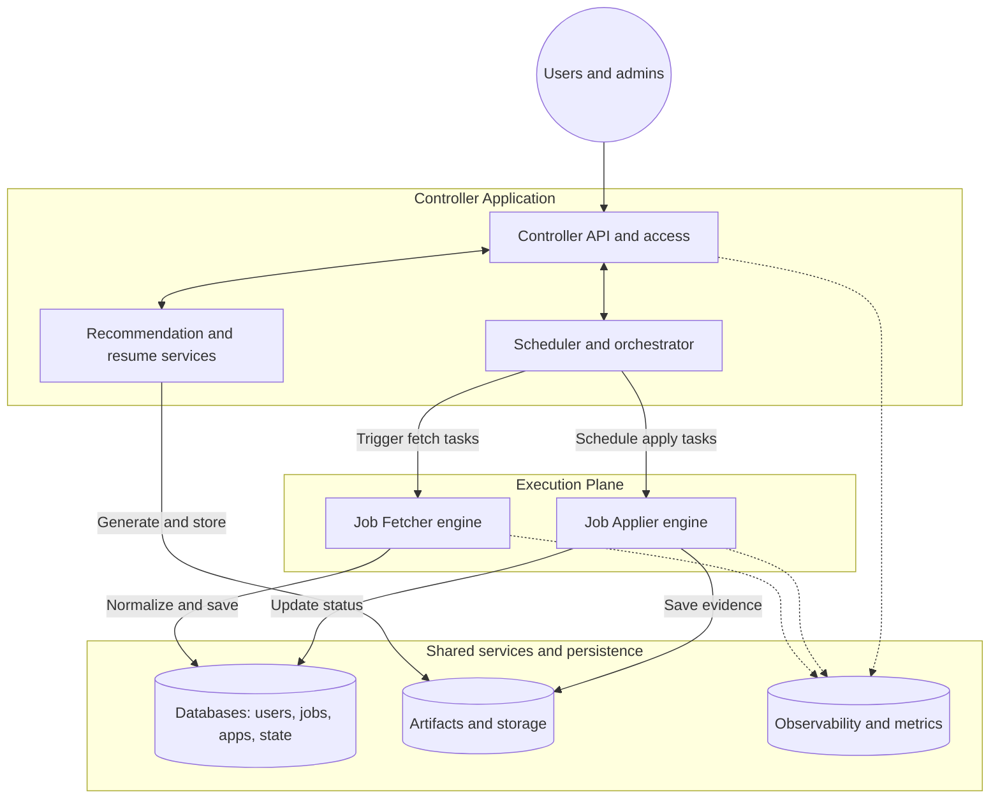
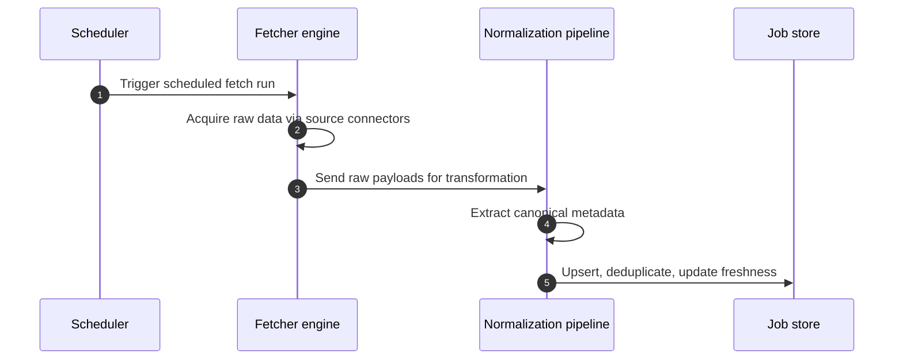
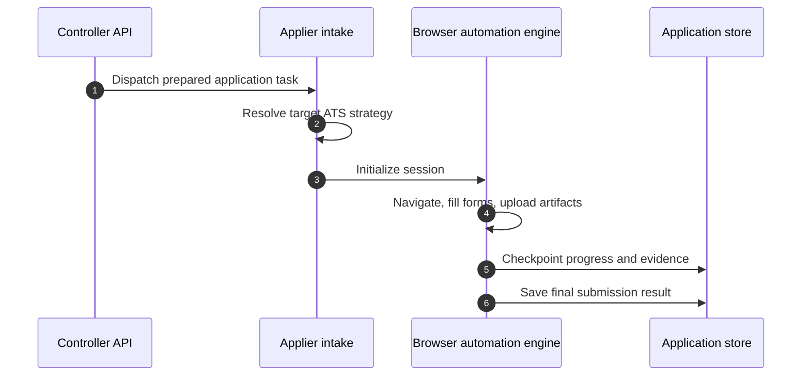

# System architecture

**Scope:** High-level architecture of the multi-tenant platform: discover jobs, tailor application materials, automate submissions, and provide operational control. The design separates a **control plane** (Controller / Control Service) from an **execution plane** (Job Fetcher and Job Applier).

**Repository mapping:** The Control Service lives in `apps/server`; execution services are `packages/jobs_scraper` (Fetcher) and `packages/jobs_applier` (Applier). See [README.md](./README.md).

### Implementation snapshot (this repo)

| Area | Status |
|------|--------|
| **Control Service** | Full FastAPI app: auth (SuperTokens), tenants/users, profiles, documents, resumes, master sections, preferences, policies, workflows, uploads (local/S3), monitoring, admin. MongoDB models + indexes in `apps/server/src/db.py`. |
| **MongoDB** | Single app database (`ai_apply_agents` by default): see [data-model-mongodb.md](./data-model-mongodb.md). |
| **Job Fetcher package** | Stub HTTP service; job/fetch **schema** lives in the Control Service models for shared storage. |
| **Job Applier package** | FastAPI bot API + Camoufox flows; **SQLite** stores resumable `FlowContext`; MongoDB stores `application_*` via the control plane. |

---

## 1. Core architectural principles

- **Separation of concerns** — The Fetcher handles data acquisition, the Applier handles automation execution, and the Controller handles orchestration and policy.
- **Stateful automation** — Fetching and applying are long-running, failure-prone workflows modeled as **resumable** processes, not only request/response RPCs.
- **Connector extensibility** — Job boards and ATSs differ; adapters and strategies avoid hardcoded, brittle flows.
- **Multi-tenant isolation** — Strict boundaries per tenant for data, automation rules, schedules, documents, and execution history.
- **Evidence and auditability** — Execution logs and captures support verification and debugging.
- **Safe automation control** — Automation runs from explicit user actions or policy-based scheduling, not indiscriminate application.

---

## 2. Subsystem component architecture

The platform has three primary applications.

### A. Controller application (control plane)

Entry point for users and admins: schedules, policy, recommendations, and access control.

- **User/admin surfaces:** Profile, job preferences, RBAC, tenant management, health/monitoring.
- **Backend API:** UI operations and internal workflow communication.
- **Scheduler/orchestrator:** Runs, retries, timed policies, rate-limited windows.
- **Recommendation engine:** Matches normalized jobs to structured profiles and preferences.
- **Resume tailoring:** ATS-oriented resume variants from profile + target job.

### B. Job Fetcher (execution plane — inbound)

Acquires listings from multiple sources and normalizes them to an internal representation.

- **Source connectors:** Public APIs, partner APIs, ATS list pages, HTML scraping.
- **Execution engine:** Crawl logic, pagination, retries, source-specific throttling.
- **Normalization pipeline:** Canonical models (skills, seniority, employment type, locations).
- **Deduplication and freshness:** Cross-source dedupe and liveliness of postings.

### C. Job Applier (execution plane — outbound)

Drives automated submissions with target-specific workflows.

- **Task intake:** Validates user readiness, job data, artifacts.
- **Strategy resolver:** Selects ATS/board workflow for the target.
- **Session manager:** Login continuity, cookies, auth context.
- **Browser engine:** Navigation, forms, uploads, submission (e.g. Camoufox in this repo).
- **Evidence capture:** Screenshots and operational logs across the lifecycle.

---

## 3. Shared platform services and domains

- **Data stores:** User/tenant data; normalized job inventory; application tasks and history; durable workflow state for resumability.
- **Documents and artifacts:** Resumes, parsed content, object storage for screenshots.
- **Observability:** Logs, traces, metrics.
- **Notifications:** User and admin alerts for runs, failures, and status changes.

---

## 4. High-level architecture flow

---

## 5. Functional workflows

### Job acquisition flow

### Application execution flow

---

## 6. Non-functional and operational architecture

- **Deployment and runtime** — Controller API instances aim to stay responsive; Fetcher and Applier work as asynchronous workers. Orchestration uses queues and durable state so user traffic is not blocked by heavy jobs.
- **Security and access control** — Tenant-scoped RBAC; PII and automation credentials protected at rest; credential access limited to the applier session path where applicable.
- **Observability** — Connector health, API logs, browser failure traces, checkpoint-to-evidence linkage (e.g. screenshots to steps).
- **Risks and constraints** — Target DOM volatility favors pluggable strategies; browser automation is resource-heavy and needs concurrency limits and queue backpressure.

---

## Related docs

- [Control Service detail](./architecture-control-service.md)
- [Job Fetcher detail](./architecture-job-fetcher.md)
- [Job Applier detail](./architecture-job-applier.md)
- [MongoDB data model sketch](./data-model-mongodb.md)
