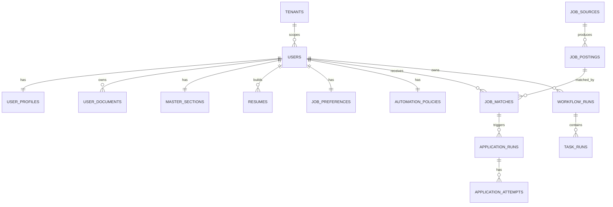

# MongoDB data model (implementation)

This document reflects the **current Control Service** persistence layer: Pydantic models under `apps/server/src/models/`, repositories under `apps/server/src/repositories/`, and indexes created in `apps/server/src/db.py` at startup.

**Default database name:** `ai_apply_agents` (override with `DB_NAME` in `apps/server` settings).

**Auth:** Users are authenticated with **SuperTokens** (separate PostgreSQL in Docker for the SuperTokens core — not application resume data).

**File blobs:** Uploads use a pluggable **storage backend** (`storage_backend`: `local` filesystem under `upload_dir`, or `s3`). MongoDB stores **metadata** (`storage_key`, URLs) on documents that reference files.

---

## Base types

- **`MongoDoc`** (`models/base.py`): `id` (maps from `_id`), `created_at`, `updated_at`.
- **`TenantDoc`**: extends `MongoDoc` with **`tenant_id`** for tenant-scoped collections.

---

## Collections overview

| Collection | Primary model | Purpose |
|------------|---------------|---------|
| `tenants` | `Tenant` | Tenant root: `name`, `slug`, `plan`, `settings`, `is_active` |
| `users` | `User` | App user linked to SuperTokens: `supertokens_user_id`, `tenant_id`, `email`, `display_name`, `role` (`admin` / `manager` / `member`), `is_active`, `last_login_at` |
| `user_profiles` | `UserProfile` | One profile per user per tenant: headline, summary, skills, experience/education/cert arrays, links |
| `user_documents` | `UserDocument` | Uploaded doc metadata: `doc_type` (`resume` \| `cover_letter` \| `other`), `storage_key`, `mime_type`, `size_bytes` |
| `master_sections` | `MasterSections` | Single source of truth sections (same `ResumeSection` shape as resumes) for tailoring / master profile |
| `resumes` | `Resume` | Built resumes: `title`, `target_role`, `sections[]` (`ResumeSection`: text/list/entries), `is_default` |
| `job_preferences` | `JobPreference` | Search preferences: titles, locations, salary range, remote, exclusions, keywords |
| `automation_policies` | `AutomationPolicy` | Auto-apply knobs: `auto_apply`, limits, `match_threshold`, `allowed_platforms`, `blocked_domains`, `schedule` |
| `job_sources` | `JobSource` | Configured fetch sources: `platform`, `adapter`, `base_url`, credentials, fetch interval |
| `job_postings` | `JobPosting` | Normalized postings: `source_id`, `external_id`, company/title/location/url, `raw_data`, flags |
| `job_matches` | `JobMatch` | User ↔ posting match: `score`, `status` (`MatchStatus`), `matched_skills`, `notes` |
| `fetch_runs` | `FetchRun` | Per-source fetch execution: `status` (`FetchRunStatus`), counts, errors, timestamps |
| `workflow_runs` | `WorkflowRun` | Orchestration run: `user_id`, `name`, `status` (`WorkflowStatus`), `trigger`, `config` |
| `task_runs` | `TaskRun` | Tasks under a workflow: `task_type` (e.g. `fetch`, `match`, `apply`), `status` (`TaskStatus`), I/O blobs |
| `application_runs` | `ApplicationRun` | Apply execution: links `match_id`, `posting_id`, `platform`, `target_url`, `status` (`ApplicationStatus`) |
| `application_attempts` | `ApplicationAttempt` | Resumable attempts: `attempt_number`, `flow_id` (links to applier bot), step/errors |
| `artifacts` | `Artifact` | Evidence: `parent_type` / `parent_id`, `artifact_type`, `storage_key`, `metadata` |
| `audit_events` | `AuditEvent` | `action`, `resource_type`, `resource_id`, `detail`, `timestamp` |
| `notifications` | `Notification` | In-app notifications: `type`, `title`, `body`, `status` (`NotificationStatus`) |

---

## Entity relationship (logical)

MongoDB does not enforce foreign keys; the app uses consistent `ObjectId` references.

---

## Status enums (`models/enums.py`)

| Enum | Values |
|------|--------|
| `WorkflowStatus` | `pending`, `running`, `paused`, `completed`, `failed`, `cancelled` |
| `TaskStatus` | `pending`, `running`, `completed`, `failed`, `skipped` |
| `ApplicationStatus` | `pending`, `in_progress`, `submitted`, `failed`, `withdrawn` |
| `FetchRunStatus` | `pending`, `running`, `completed`, `failed` |
| `MatchStatus` | `new`, `approved`, `rejected`, `applied`, `expired` |
| `NotificationStatus` | `unread`, `read`, `dismissed` |

---

## Indexes (startup)

Defined in `ensure_indexes()` in `apps/server/src/db.py`. Notable examples:

- `users`: unique `(tenant_id, email)`; unique `supertokens_user_id`
- `user_profiles`: unique `(tenant_id, user_id)`
- `job_postings`: unique `(tenant_id, source_id, external_id)`
- `job_matches`: unique `(tenant_id, user_id, posting_id)`
- `master_sections`: unique `(tenant_id, user_id)`

---

## What lives outside this MongoDB database

| System | Storage | Notes |
|--------|---------|--------|
| SuperTokens session/auth | PostgreSQL (Docker) | Managed by SuperTokens core; not application domain tables |
| Job Applier flow checkpoints | **SQLite** `bot_state.db` (`flow_contexts` table) | See `packages/jobs_applier/src/bot/persistence.py` |
| Uploaded file bytes | Local dir or S3 | Keys referenced from `user_documents`, uploads API, etc. |

---

## Job Fetcher service vs MongoDB

The **Job Fetcher** package (`packages/jobs_scraper`) is currently a **minimal FastAPI stub** (`/health`, `/scrape` placeholder). **Job domain documents** (`job_sources`, `job_postings`, `fetch_runs`, …) are **modeled and indexed in the Control Service** and are intended to be written by fetcher logic or future integration — the canonical schema is the Pydantic models above.

---

## Related code paths

- Models: `apps/server/src/models/*.py`
- Indexes: `apps/server/src/db.py`
- Repositories: `apps/server/src/repositories/*.py`
- Monitoring reads: `apps/server/src/services/monitoring.py`

---

## Related docs

- [System architecture](./architecture.md)
- [Control Service architecture](./architecture-control-service.md)
- [MASTER_PROMPT.md](./MASTER_PROMPT.md) (planning-level collection names may differ slightly; this file is authoritative for the repo)
